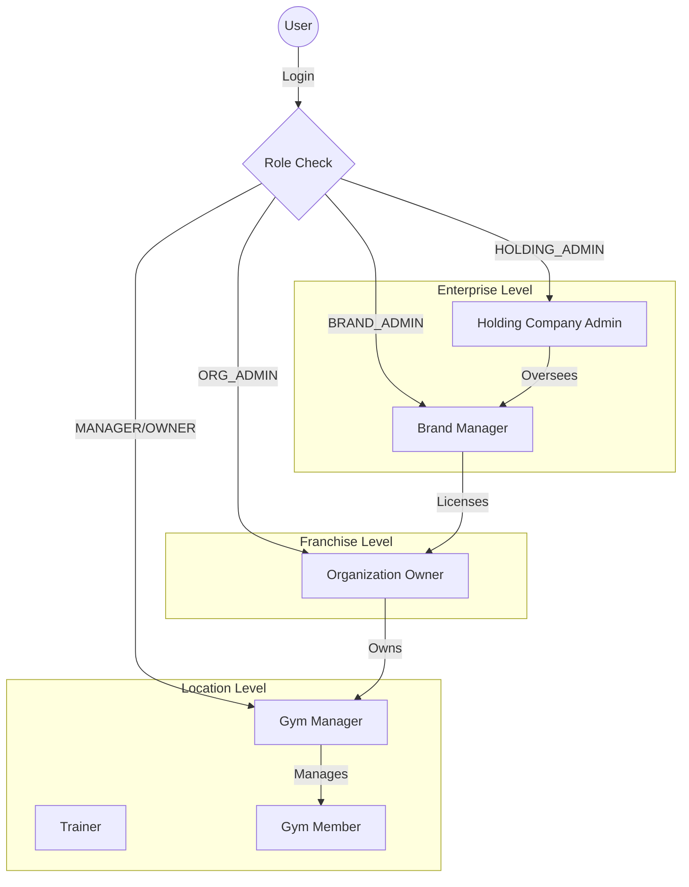
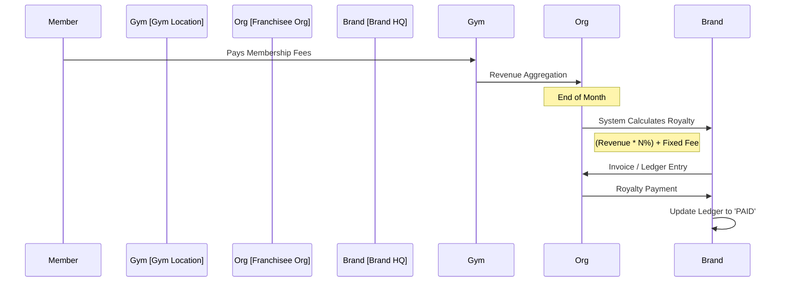

# GymEdge Product Flow 🔄

This document outlines the end-to-end flow of the GymEdge platform, covering both the **Core SaaS** (Single Gym) and the **Enterprise** (Multi-Brand) levels.

## 1. The Ecosystem Overview

GymEdge serves three distinct layers of users:
1.  **Enterprise Layer:** Holding Companies & Brands (Top-level management).
2.  **Franchise Layer:** Organization Owners (Business operators).
3.  **Operational Layer:** Gym Managers & Trainers (Day-to-day ops).

---

## 2. Core User Journeys

### A. The Gym Owner / Franchisee Flow
**Goal:** Manage business health, revenue, and staff.

1.  **Onboarding:**
    *   Sign up via Web / Mobile.
    *   Define Gym Name & Location.
    *   (Enterprise) Link to a Parent Brand.
2.  **Dashboard:**
    *   View **Business Health**: Revenue MTD, Active Members, Churn Risk.
    *   (Enterprise) View **Royalty Ledger**: Monthly dues to the Brand.
3.  **Member Management:**
    *   **Add Member:** Input details -> Auto-send WhatsApp Welcome.
    *   **Bulk Import:** Upload CSV -> System parses & creates profiles.
    *   **AI Scan:** Upload ID Card -> AI extracts details -> Auto-fill form.
4.  **Revenue & Billing:**
    *   Assign Membership Plans.
    *   Track Payments (Cash/Online).
    *   Receive Daily Revenue Reports via WhatsApp.

### B. The Gym Manager / Staff Flow
**Goal:** Day-to-day operations and member engagement.

1.  **Login:** OTP-based login linked to specific location.
2.  **Attendance:**
    *   Mark Member Attendance (QR / Manual).
    *   System checks "Last Visit" -> Updates Churn Risk Score.
3.  **Engagement:**
    *   View **"Action Needed"** list (e.g., "Call Rahul - Absent 7 days").
    *   Send automated WhatsApp reminders for renewals.

### C. The Enterprise Admin Flow (New!)
**Goal:** Strategic oversight and royalty collection.

1.  **Global Dashboard:**
    *   View aggregated stats across all Brands and Locations.
    *   Drill down into specific Organizations.
2.  **Royalty Tracking:**
    *   System calculates **Gross Revenue** per Organization monthly.
    *   Applies **Royalty %** (e.g., 10%) + **Flat Fee**.
    *   Generates **Royalty Ledger** (Due/Paid status).

---

## 3. Data & Automation Flow

### AI & Intelligence Layer 🧠
GymEdge uses AI not just for chat, but for **Business Logic**:

1.  **Churn Prediction:**
    *   *Input:* Attendance patterns, Payment history, Interaction logs.
    *   *Process:* AI Model analyzes drop-off trends.
    *   *Output:* **Churn Risk Score (0-100)** + Recovery Plan.
2.  **Smart Alerts:**
    *   "Revenue dropped 15% vs last month."
    *   "3 High-Value members are at risk of leaving."

### WhatsApp Automation 💬
We prioritize "Push" over "Pull". Owners shouldn't have to login to know their status.

*   **Trigger:** New Member Joined -> **Action:** Send Welcome PDF + Receipt.
*   **Trigger:** 3 Days before Expiry -> **Action:** Send Payment Link.
*   **Trigger:** Daily 9 PM -> **Action:** Send "Daily Business Summary" to Owner.

---

## 4. Financial Flow (Royalty Logic)

For Franchise operations, money flows up:

